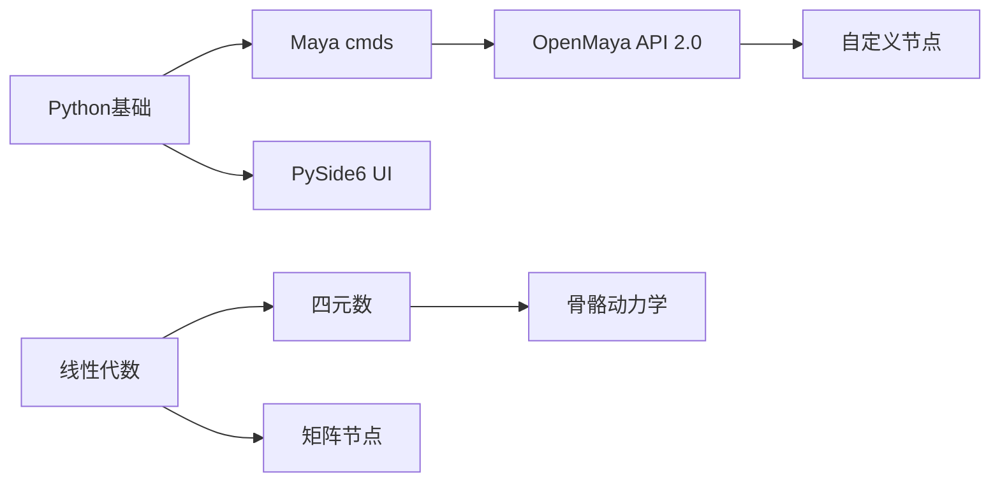

# 🗺️ CGI 技术全景

> CGI / VFX Technical Artist 知识体系的全局地图

---

## 技术树

> CGI / VFX 技术体系

### 🦴 角色绑定（Character Rigging）
- 骨骼系统（Skeleton System）
- 蒙皮（Skinning）
- 面部绑定（Facial Rig） → [[0. MetaHuman - 目录|MetaHuman面部]]
- 骨骼动力学（Bone Dynamics）
- 驱动关系（PSD / RBF）

### 🔧 Maya 工具开发
- OpenMaya API 2.0 → [[常用操作速查表|API速查]]
- 自定义节点（MPxNode）
- 节点图（DG求值）
- PySide6 UI

### 🌊 物理动力学
- Ziva Dynamics
- nCloth / 布料
- 物理仿真理论

### 📐 数学基础
- 线性代数 → [[0. 3D数学基础 - 目录|3D数学基础]]
- 矩阵变换 → [[2. 矩阵|矩阵变换]]
- 四元数与旋转 → [[7. 欧拉角与四元数|四元数与旋转]]

### ⚙️ C++ 编程
- Effective Modern C++ → [[0. Effective Modern C++ - 目录|Effective Modern C++]]
- 并发编程 → [[0. C++并发编程实战 - 目录|C++并发编程实战]]

### 💻 计算机科学
- 设计模式 → [[0. 设计模式 - 目录|设计模式]]

### 🖥️ 实时渲染
- 图形学基础 → [[0. 计算机图形学 - 目录|计算机图形学]]
- DirectX 12 → [[1. Direct3D初始化]]
- 着色器（HLSL / GLSL）

### 🎮 游戏引擎
- **Unreal Engine**
    - MetaHuman / DNA → [[0. MetaHuman - 目录|MetaHuman]]
    - RigLogic → [[3. RigLogic]]
    - SkeletalMesh动画 → [[0. SkeletalMesh动画 - 目录|SkeletalMesh动画]]
    - 网络同步 → [[0. UE网络同步 - 目录|UE网络同步]]
    - 多线程 → [[0. UE多线程 - 目录|UE多线程]]
    - 框架结构 → [[0. UE框架结构 - 目录|UE框架结构]]
- **Unity** → [[0. 整体结构框架|Unity整体结构]]

### 🤖 AI 与机器学习 (AI for CG)
- 视频动作捕捉 (Video Mocap) → [[1. 视频动捕开源方案|单目AI动捕方案]]
- 空间网格对齐与变形转移 → [[2. 空间网格映射与变形转移算法]]
- 生成式 AI (4dhumans, GENMO 等)

---

## 关键技术连接

| 技术A          | 关系  | 技术B          | 说明                |
| :----------- | :-: | :----------- | :---------------- |
| Maya 绑定      |  →  | UE MetaHuman | DNA/RigLogic 导出流程 |
| OpenMaya API |  →  | 自定义节点        | MPxNode 开发        |
| 四元数          |  →  | 骨骼动力学        | SLERP 插值旋转        |
| SSDR 算法      |  →  | 蒙皮           | 数据驱动权重优化          |
| PBD 动力学      |  →  | Ziva/布料      | 基于位置的物理求解         |

---

## 学习路径推荐

---

## 重要参考文献

> 完整列表见 [[📚 PDF文献库索引]]

| 文献 | 关联知识 |
|:---|:---|
| RigLogic白皮书 | MetaHuman 运行时架构 |
| Physics-Based Animation | 物理仿真 |
| Anatomy of Facial Expressions | 面部绑定参考 |
| maya_api_whitepaper | OpenMaya API |
| SSDR-presentation | 蒙皮算法 |
